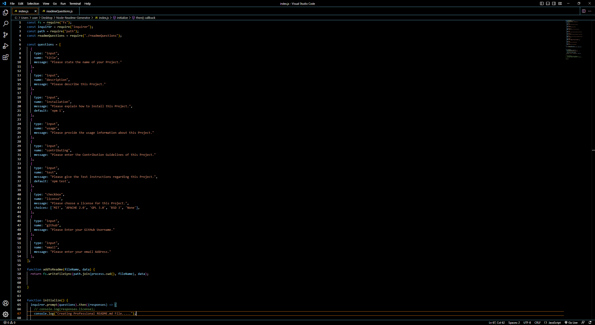
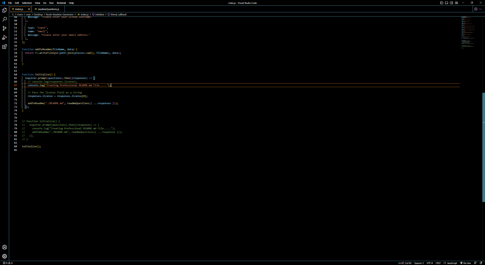
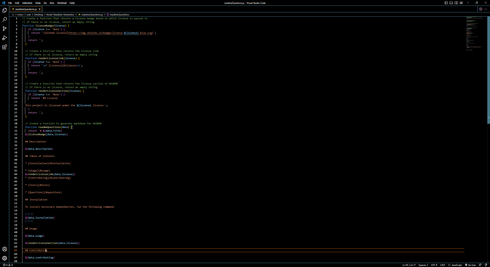
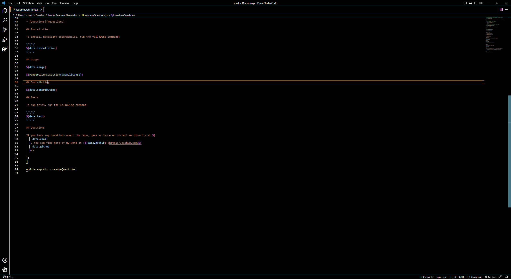
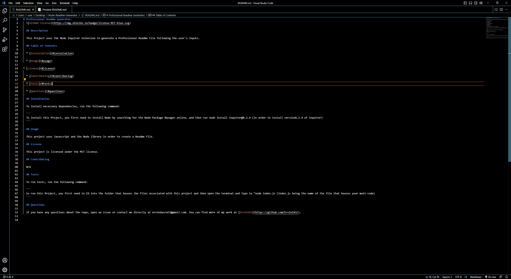
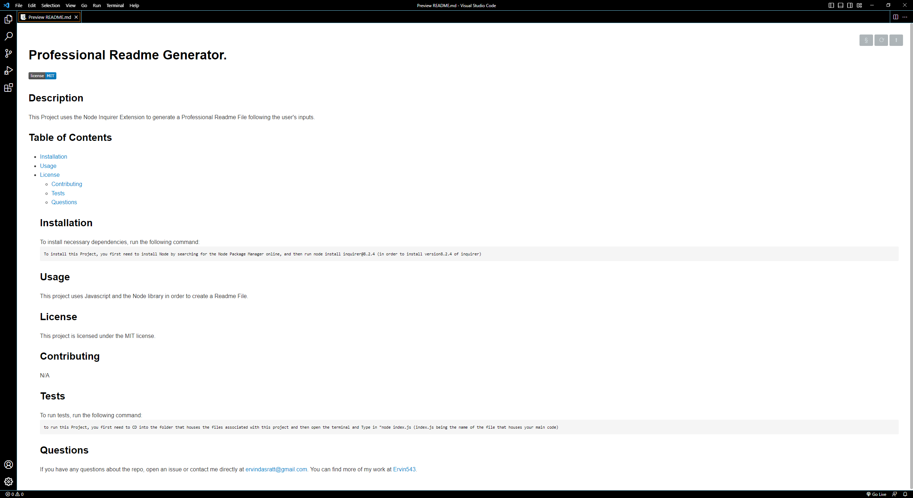

# Project Description #

This Project houses code that will create a Professional Readme based on a Users Inputs. It uses the inquirer node package to take in a users prompts to satisfy the questions presented, in order to create a Readme.md file. Users have to install the node inquirer package in order to properly use this project.

# Screenshots #

# Links #

Video Submission link : https://drive.google.com/file/d/1WKX_P2XDR2GYaJB2E2VBtCTG7IFZGuOo/view

GitHub Repository Link : https://github.com/Ervin543/Node-Readme-Generator

